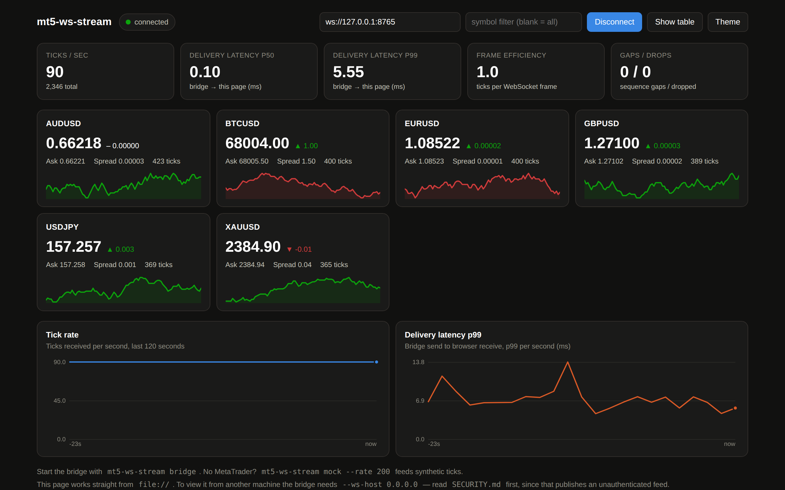

<!-- markdownlint-disable MD033 MD041 -->
<h1 align="center">mt5-ws-stream</h1>

<p align="center">
  <strong>Low-latency MetaTrader 5 tick streaming over WebSocket.</strong><br>
  Expert Advisor → Python bridge → any WebSocket client.
</p>

<p align="center">
  <a href="https://github.com/komo135/mt5-ws-stream/actions/workflows/ci.yml"></a>
  <a href="https://pypi.org/project/mt5-ws-stream/"></a>
  <a href="https://pypi.org/project/mt5-ws-stream/"></a>
  <a href="LICENSE"></a>
</p>

<p align="center">
  <a href="README.ja.md">日本語 README</a> ·
  <a href="docs/architecture.md">Architecture</a> ·
  <a href="docs/protocol.md">Protocol</a> ·
  <a href="docs/latency.md">Latency</a> ·
  <a href="docs/troubleshooting.md">Troubleshooting</a>
</p>

---

```
MetaTrader 5                 mt5-ws-stream                    your code
┌──────────────────┐        ┌──────────────────┐        ┌──────────────────┐
│ TickStreamer.mq5 │  TCP   │      bridge      │WS/REST │ browser / bot /  │
│                  ├───────►│ (one port: /ws + ├───────►│ recorder / chart │
└──────────────────┘        │  /api/v1 + docs) │        │ / dashboard      │
                            └──────────────────┘        └──────────────────┘
```

EA on a chart sends ticks to a local Python bridge. The bridge sends them to
your WebSocket clients. Default JSON. Stream, REST, dashboard and OpenAPI on
one port.

## Requirements

| | |
| --- | --- |
| Python | >= 3.14 |
| Runtime dependencies | Python 3.14-compatible releases of websockets, AnyIO, FastAPI, Pydantic, Starlette and uvicorn |
| Live market data | MetaTrader 5 on Windows |
| Compiling the EA | MetaEditor (ships with the terminal) |

## Installation

```bash
pip install mt5-ws-stream
```

## Quick start

1. Copy `mql5/Experts/TickStreamer/TickStreamer.mq5` into `MQL5/Experts/` in the
   terminal's data folder (**File → Open Data Folder**).
2. Compile it in MetaEditor (<kbd>F7</kbd>).
3. **Tools → Options → Expert Advisors → "Allow WebRequest for listed URL"** → add
   `127.0.0.1`. MQL5 socket functions share this allow-list; without the entry
   `SocketCreate()` fails with error 4014.
4. Enable **Algo Trading** on the toolbar.
5. Start the bridge, then drag the EA onto a chart:

```bash
mt5-ws-stream bridge
```

The Experts tab prints `[TickStreamer] connected to 127.0.0.1:9800` on success.

Print ticks:

```bash
mt5-ws-stream client --print
```

Open the dashboard:

```bash
mt5-ws-stream dashboard
```

That is `http://127.0.0.1:8765/dashboard`, served by the bridge.

<p align="center">
  
</p>

## Usage

### Python

```python
import asyncio
from mt5_ws_stream import TickStreamClient


async def main() -> None:
    async with TickStreamClient(symbols=["EURUSD", "USDJPY"]) as stream:
        async for tick in stream:
            print(f"{tick.symbol} {tick.bid} / {tick.ask}  spread={tick.spread:.5f}")


asyncio.run(main())
```

Latest price only (dashboards, tickers):

```python
TickStreamClient(symbols=["EURUSD"], backpressure="conflate")
```

`async for tick in stream` is `stream.ticks()`: one tick at a time, JSON or
binary. For ticks-per-frame, `stats` / `ack` replies, or hop measurement, use
`stream.stream()` — one decoded frame per WebSocket message:

```python
from mt5_ws_stream import ControlFrame, TickFrame

async with TickStreamClient() as stream:
    async for frame in stream.stream():
        if isinstance(frame, TickFrame):
            print(len(frame.ticks), "ticks, hop", frame.hop)
        elif isinstance(frame, ControlFrame):
            print(frame.kind, frame.payload)
```

`subscribe()`, `unsubscribe()`, `set_format()`, `request_stats()`, `ping()` send
the matching op. The reply arrives as a `ControlFrame` on `stream.stream()`.
`frame.hop` is `received_at - rx` in seconds; `None` on binary frames, which
carry no send timestamp.

### Browser / JavaScript

```js
const ws = new WebSocket("ws://127.0.0.1:8765/ws?symbols=EURUSD");
ws.onmessage = (event) => {
  const frame = JSON.parse(event.data);
  if (frame.t !== "ticks") return;
  for (const d of frame.d) console.log(d.s, d.b, d.a);
};
```

[`examples/`](examples/) has a minimal Python client, a CSV recorder, a Node.js
client, and a single-file HTML page.

## More than one symbol

Empty `InpSymbols`: the chart the EA is attached to.

`InpSymbols=EURUSD,USDJPY` (or `*` for Market Watch): those symbols from the
same chart. Extra symbols are collected on the terminal timer (`InpPollMs`;
10–16 ms on Windows). Every tick is delivered. Extra symbols wait up to one
timer period.

One EA per chart keeps every symbol event-driven.

To drop the timer wait on extra symbols without extra charts, see
[docs/latency.md](docs/latency.md#extra-symbols-polling-or-events)
(`EXTRA_EVENT`).

The terminal truncates `InpSymbols` at 244 characters
([details](docs/troubleshooting.md#inpsymbols-is-truncated-at-244-characters)).

## Configuration

### `mt5-ws-stream bridge`

| Flag | Default | Meaning |
| --- | --- | --- |
| `--tcp-host` | `127.0.0.1` | Bind address for the EA |
| `--tcp-port` | `9800` | Must match the EA's `InpPort` |
| `--ws-host` | `127.0.0.1` | Bind address for consumers (HTTP + WebSocket) |
| `--http-port` | `8765` | Consumer port; serves HTTP and WebSocket |
| `--queue-limit` | `20000` | Ticks buffered per `lossless` consumer before shedding |
| `--stats-interval` | `10.0` | Seconds between stats log lines and `stats` frames; `0` disables both |
| `--allow-origin` | *(any)* | Restrict browser `Origin` values on the WebSocket; repeatable |

Global flags: `-v` / `--verbose` for debug logging, `--version`.

| Command | Purpose |
| --- | --- |
| `client` | Print ticks, or `--bench SECONDS` |
| `dashboard` | Open the bundled dashboard (`--url`, `--print-path`) |

### Expert Advisor inputs

| Input | Default | Meaning |
| --- | --- | --- |
| `InpHost` | `127.0.0.1` | Bridge host |
| `InpPort` | `9800` | Bridge TCP port |
| `InpReconnectMs` | `2000` | Backoff before a reconnect attempt, in milliseconds |
| `InpHeartbeatMs` | `1000` | Heartbeat interval in milliseconds; `0` disables |
| `InpSymbols` | *(empty)* | Extra symbols: comma-separated list, or `*` for Market Watch. Empty = chart symbol only |
| `InpPollMs` | `10` | Timer period for extra symbols, in milliseconds. The terminal's real resolution is 10–16 ms |
| `InpUtcTimestamps` | `true` | Convert `time_msc` from broker server time to UTC |
| `InpVerbose` | `true` | Log connection events and errors |
| `InpStatsSec` | `60` | Print a throughput summary every N seconds; `0` disables |

## API

### WebSocket

Connect at `ws://host:8765/ws`. `/` is the HTTP index, not the stream.

| Query parameter | Default | Meaning |
| --- | --- | --- |
| `symbols` | all | Comma-separated allow-list |
| `format` | `json` | `json` or `binary` (raw 64-byte records) |
| `conflate` | `0` | `1` keeps only the newest tick per symbol under load |
| `heartbeats` | `0` | `1` also delivers keep-alive records |

Unknown parameters are ignored. A parameter given twice takes its last value.
Percent-encode `#` in a symbol name as `%23`.

Server frames carry their type in `t`: `hello` (once, with a snapshot of the
latest prices), `ticks`, `stats`, `ack`, `pong`, `error`. Client control frames
are `subscribe`, `unsubscribe`, `format`, `stats`, `ping`. Full reference:
[docs/protocol.md](docs/protocol.md).

`hello.symbols` is this connection's filter (`null` = every symbol, `[]` =
none). `hello.available` is every symbol the bridge has seen since it started.
A symbol picker uses `available`; a consumer tracking its own subscription uses
`symbols`.

### REST

All endpoints are `GET`. CORS is open to any origin, `GET` only. The WebSocket
has its own `--allow-origin` flag.

| Endpoint | Returns |
| --- | --- |
| `/` | JSON index of the routes below |
| `/api/v1/health` | Liveness: status, uptime, version |
| `/api/v1/symbols` | Latest quote for every symbol seen since start; `?symbols=A,B` filters |
| `/api/v1/symbols/{symbol}` | Latest quote for one symbol; 404 if unknown |
| `/api/v1/stats` | The same counters as the WebSocket `stats` frame |
| `/api/v1/feeders` | Connected feeders |
| `/dashboard` | The bundled single-file dashboard |
| `/docs`, `/openapi.json` | Interactive API docs / OpenAPI schema |

```bash
curl http://127.0.0.1:8765/api/v1/symbols
```

## Performance

Bridge → consumer hop on loopback, JSON: **p50 0.091 ms / p99 0.176 ms** at
200 ticks/s; **p50 0.101 ms / p99 0.186 ms** at 20,000 ticks/s. Live hop p50
is 0.16–0.18 ms. Tables and method:
[docs/latency.md](docs/latency.md).

## Documentation

| When | Where |
| --- | --- |
| Error 4014, sparse updates, gaps | [docs/troubleshooting.md](docs/troubleshooting.md) |
| Binary records and WebSocket frames | [docs/protocol.md](docs/protocol.md) |
| Measured latency, extra symbols | [docs/latency.md](docs/latency.md) |
| Components and failure modes | [docs/architecture.md](docs/architecture.md) |
| Sample Python, Node.js, browser clients | [examples/README.md](examples/README.md) |
| Tests, CI, synthetic feeder | [CONTRIBUTING.md](CONTRIBUTING.md) |
| Release history | [CHANGELOG.md](CHANGELOG.md) |

## License

MIT — see [LICENSE](LICENSE).
